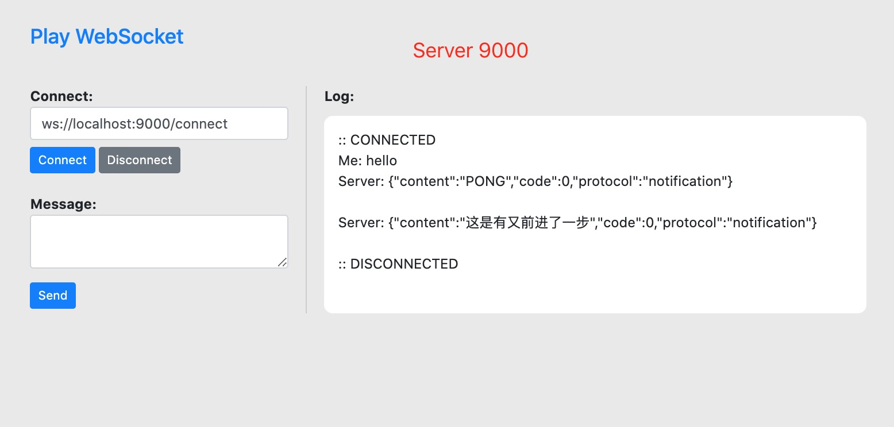
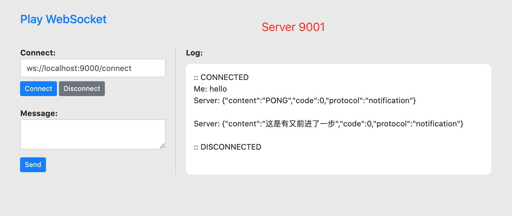

# The simplest possible Scala / Play Framework WebSocket example

This source code shows the “simplest possible” Play Framework WebSocket
example. The server side of the code is almost as simple as it can be,
except that I use `JsValue` types instead of `String`. Using `String` 
would make it slightly easier, but using `JsValue` and JSON makes it
a more real-world example.

## 使用

启动第一个Node
```scala
➜  play-websocket-seed git:(master) ✗ sbt run  (服务默认端口9000 Akka Node端口为25510)
[info] Loading global plugins from /Users/genban/.sbt/1.0/plugins
[info] Loading settings for project play-websocket-seed-build from plugins.sbt,metals.sbt ...
[info] Loading project definition from /Users/genban/tmp/play-websocket-seed/project
[info] Loading settings for project root from build.sbt ...
[info] Set current project to play-websocket-seed (in build file:/Users/genban/tmp/play-websocket-seed/)

--- (Running the application, auto-reloading is enabled) ---

[info] p.c.s.AkkaHttpServer - Listening for HTTP on /0:0:0:0:0:0:0:0:9000

(Server started, use Enter to stop and go back to the console...)

[DEBUG] [01/22/2021 14:41:39.008] [play-dev-mode-akka.actor.default-dispatcher-9] [EventStream] StandardOutLogger started
2021-01-22 14:41:39 INFO  akka.event.slf4j.Slf4jLogger Slf4jLogger started
[DEBUG] [01/22/2021 14:41:39.140] [play-dev-mode-akka.actor.default-dispatcher-9] [EventStream(akka://application)] logger log1-Slf4jLogger started
[DEBUG] [01/22/2021 14:41:39.143] [play-dev-mode-akka.actor.default-dispatcher-9] [EventStream(akka://application)] Default Loggers started
2021-01-22 14:41:39 INFO  a.r.artery.tcp.ArteryTcpTransport Remoting started with transport [Artery tcp]; listening on address [akka://application@127.0.0.1:25510] with UID [8589628638635706801]
2021-01-22 14:41:39 INFO  akka.cluster.Cluster Cluster Node [akka://application@127.0.0.1:25510] - Starting up, Akka version [2.6.1] ...
2021-01-22 14:41:39 INFO  akka.cluster.Cluster Cluster Node [akka://application@127.0.0.1:25510] - Registered cluster JMX MBean [akka:type=Cluster]
2021-01-22 14:41:39 INFO  akka.cluster.Cluster Cluster Node [akka://application@127.0.0.1:25510] - Started up successfully
2021-01-22 14:41:40 INFO  akka.cluster.Cluster Cluster Node [akka://application@127.0.0.1:25510] - No downing-provider-class configured, manual cluster downing required, see https://doc.akka.io/docs/akka/current/typed/cluster.html#downing
2021-01-22 14:41:40 INFO  akka.cluster.Cluster Cluster Node [akka://application@127.0.0.1:25510] - Node [akka://application@127.0.0.1:25510] is JOINING itself (with roles [dc-default]) and forming new cluster
2021-01-22 14:41:40 INFO  akka.cluster.Cluster Cluster Node [akka://application@127.0.0.1:25510] - is the new leader among reachable nodes (more leaders may exist)
2021-01-22 14:41:40 INFO  akka.cluster.Cluster Cluster Node [akka://application@127.0.0.1:25510] - Leader is moving node [akka://application@127.0.0.1:25510] to [Up]
2021-01-22 14:41:41 INFO  Components Actor ShardRegions have been started.
2021-01-22 14:41:41 INFO  akka.cluster.sharding.ShardRegion notification_actors: Idle entities will be passivated after [2.000 min]
2021-01-22 14:41:41 INFO  akka.actor.EmptyLocalActorRef Message [akka.cluster.sharding.ShardCoordinator$Internal$Register] from Actor[akka://application/system/sharding/notification_actors#-1360573680] to Actor[akka://application/system/sharding/notification_actorsCoordinator/singleton/coordinator] was not delivered. [1] dead letters encountered. If this is not an expected behavior then Actor[akka://application/system/sharding/notification_actorsCoordinator/singleton/coordinator] may have terminated unexpectedly. This logging can be turned off or adjusted with configuration settings 'akka.log-dead-letters' and 'akka.log-dead-letters-during-shutdown'.
2021-01-22 14:41:41 INFO  a.c.s.ClusterSingletonManager Singleton manager starting singleton actor [akka://application/system/sharding/notification_actorsCoordinator/singleton]
2021-01-22 14:41:41 INFO  a.c.s.ClusterSingletonManager ClusterSingletonManager state change [Start -> Oldest]
2021-01-22 14:41:41 INFO  a.c.sharding.DDataShardCoordinator ShardCoordinator was moved to the active state State(Map())
2021-01-22 14:41:42 INFO  Components System has been started.
2021-01-22 14:41:42 INFO  play.api.Play Application started (Dev) (no global state)
2021-01-22 14:42:02 INFO  akka.cluster.Cluster Cluster Node [akka://application@127.0.0.1:25510] - Received InitJoin message from [Actor[akka://application@127.0.0.1:25501/system/cluster/core/daemon/joinSeedNodeProcess-1#594020595]] to [akka://application@127.0.0.1:25510]
2021-01-22 14:42:02 INFO  akka.cluster.Cluster Cluster Node [akka://application@127.0.0.1:25510] - Sending InitJoinAck message from node [akka://application@127.0.0.1:25510] to [Actor[akka://application@127.0.0.1:25501/system/cluster/core/daemon/joinSeedNodeProcess-1#594020595]] (version [2.6.1])
2021-01-22 14:42:05 INFO  akka.cluster.Cluster Cluster Node [akka://application@127.0.0.1:25510] - Node [akka://application@127.0.0.1:25501] is JOINING, roles [dc-default]
2021-01-22 14:42:06 INFO  akka.cluster.Cluster Cluster Node [akka://application@127.0.0.1:25510] - Leader is moving node [akka://application@127.0.0.1:25501] to [Up]
2021-01-22 14:42:07 INFO  akka.cluster.Cluster Cluster Node [akka://application@127.0.0.1:25510] - is no longer leader
```

启动第二个Node
```scala
➜  play-websocket-seed git:(master) ✗ sbt -Dhttp.port=9001 -DNODE_PORT=25501 run (服务默认端口9001 Akka Node端口为25501)
[info] Loading global plugins from /Users/genban/.sbt/1.0/plugins
[info] Loading settings for project play-websocket-seed-build from plugins.sbt,metals.sbt ...
[info] Loading project definition from /Users/genban/tmp/play-websocket-seed/project
[info] Loading settings for project root from build.sbt ...
[info] Set current project to play-websocket-seed (in build file:/Users/genban/tmp/play-websocket-seed/)

--- (Running the application, auto-reloading is enabled) ---

[info] p.c.s.AkkaHttpServer - Listening for HTTP on /0:0:0:0:0:0:0:0:9001

(Server started, use Enter to stop and go back to the console...)

[DEBUG] [01/22/2021 14:41:56.963] [play-dev-mode-akka.actor.default-dispatcher-10] [EventStream] StandardOutLogger started
2021-01-22 14:41:57 INFO  akka.event.slf4j.Slf4jLogger Slf4jLogger started
[DEBUG] [01/22/2021 14:41:57.108] [play-dev-mode-akka.actor.default-dispatcher-10] [EventStream(akka://application)] logger log1-Slf4jLogger started
[DEBUG] [01/22/2021 14:41:57.109] [play-dev-mode-akka.actor.default-dispatcher-10] [EventStream(akka://application)] Default Loggers started
2021-01-22 14:41:57 INFO  a.r.artery.tcp.ArteryTcpTransport Remoting started with transport [Artery tcp]; listening on address [akka://application@127.0.0.1:25501] with UID [-7008261213005451589]
2021-01-22 14:41:57 INFO  akka.cluster.Cluster Cluster Node [akka://application@127.0.0.1:25501] - Starting up, Akka version [2.6.1] ...
2021-01-22 14:41:58 INFO  akka.cluster.Cluster Cluster Node [akka://application@127.0.0.1:25501] - Registered cluster JMX MBean [akka:type=Cluster]
2021-01-22 14:41:58 INFO  akka.cluster.Cluster Cluster Node [akka://application@127.0.0.1:25501] - Started up successfully
2021-01-22 14:41:58 INFO  akka.cluster.Cluster Cluster Node [akka://application@127.0.0.1:25501] - No downing-provider-class configured, manual cluster downing required, see https://doc.akka.io/docs/akka/current/typed/cluster.html#downing
2021-01-22 14:42:00 INFO  Components Actor ShardRegions have been started.
2021-01-22 14:42:01 INFO  akka.cluster.sharding.ShardRegion notification_actors: Idle entities will be passivated after [2.000 min]
2021-01-22 14:42:04 INFO  akka.cluster.Cluster Cluster Node [akka://application@127.0.0.1:25501] - Received InitJoinAck message from [Actor[akka://application@127.0.0.1:25510/system/cluster/core/daemon#-369337288]] to [akka://application@127.0.0.1:25501]
2021-01-22 14:42:04 INFO  Components System has been started.
2021-01-22 14:42:05 INFO  play.api.Play Application started (Dev) (no global state)
2021-01-22 14:42:05 INFO  akka.cluster.Cluster Cluster Node [akka://application@127.0.0.1:25501] - Welcome from [akka://application@127.0.0.1:25510]
2021-01-22 14:42:07 INFO  a.c.s.ClusterSingletonManager ClusterSingletonManager state change [Start -> Younger]
2021-01-22 14:42:08 INFO  akka.cluster.Cluster Cluster Node [akka://application@127.0.0.1:25501] - is the new leader among reachable nodes (more leaders may exist)
```
分别访问localhost:9000 和 localhost:9001 并分别创建 websocket 连接

测试 使用broadcast广播一条数据(这里的userId是当前服务的requestId)
```shell
➜  ~ curl -X POST -H 'Content-type: application/json' -d '{"userIds": ["11", "12"]}' http://localhost:9000/broadcast
["message","success"]
```

